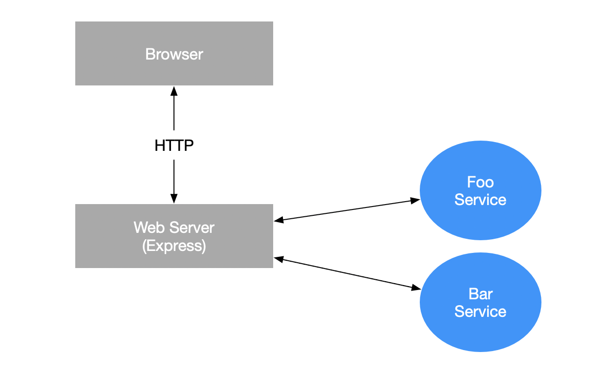
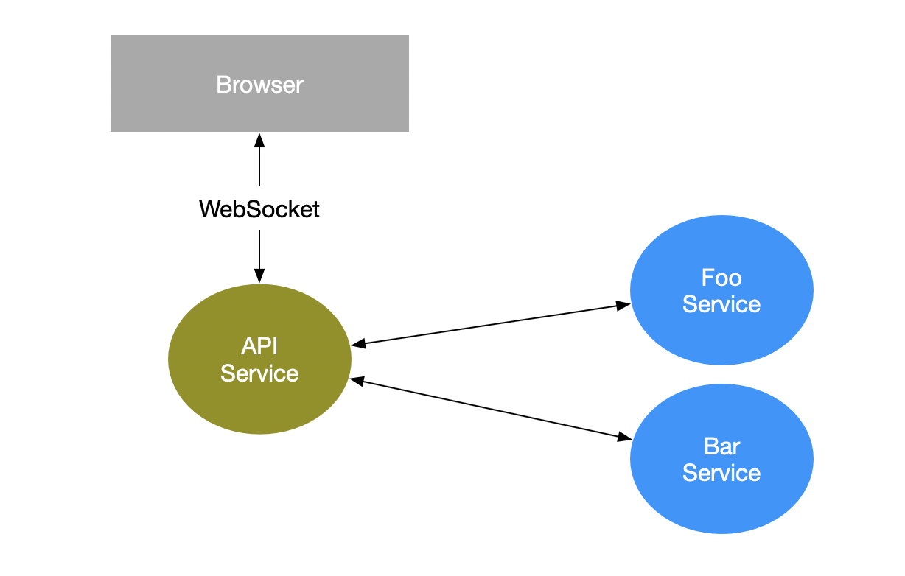

# @phnq/service

[](https://circleci.com/gh/pgostovic/service)

[](https://badge.fury.io/js/%40phnq%2Fservice)

> TL;DR - jump to [Getting Started](#getting-started) for a barebones example.

## Microservices Made Easy

The pros and cons of microservices as an architectural pattern are an oft debated topic in software engineering circles. One ubiquitously shared opinion is that **ease of implementation** is not in the pros column. The `@phnq/service` library aims to take some of the pain out of getting started with microservices by providing  utilities that deal with the basic plumbing.

#### What are microservices?
> Microservices are a way of breaking up a large application into smaller, more manageable pieces. Each piece is a self-contained service that communicates with other services via a network protocol. The services are typically deployed in separate processes or on distinct machines.
-- GitHub Copilot

But lets just call them `services`.

## Overview
Before we get into the details, here's a quick overview of the basic moving parts and actors in @phnq/service.

### Service

A service is really quite simple. It is merely a collection of handlers associated with a domain.
- `handler` -- a named function that receieves a single argument (the payload) and returns some result.
- `domain` -- a string that identifies the service.

If this sounds like a web server, that's because it's more or less the same thing semantically. It's different under the hood, but the idea is the same. A service is a server that handles requests.

### Service Client

A service client provides a way to interact with a service. A service client is also associated with a domain, but instead of handling requests, it makes requests to a service with the same domain name. A service client's programmatic API methods are named after the handlers of the service it interacts with.

> In the context of a whole system (i.e. frontend, backend, etc.), a service client as described above may seem like it would run in a web brower or mobile device, but it actually runs in the backend. Services and service clients provide a way for backend components to communicate with each other.

### Web Server/REST API Integration

Service clients can be used within a web server application like an Express app. Side requests can be made to services while the HTTP server handles requests.



### API Service (WebSocket)

An alternative architecture to the traditional web server one involves having all API communication happen over a WebSocket. This architecture has many advantages which will be outlined below.




## Getting Started

Here's a barebones example of how to use `@phnq/service` to create a service and a client for that service.

#### Run NATS
You will need a [NATS](https://nats.io/) server running. You can run one locally with Docker:
```
docker run nats
```

#### Create an API interface

This interface will be used by both the service and the client.

```ts
interface GreetingsApi {
  greet: (name: string) => Promise<string>;
}
```

#### Create a Service

Use the interface created above to define the service's handlers.

```ts
import { Service } from "@phnq/service";

const greetingsService = new Service<GreetingsApi>('greetings', {
  handlers: {
    greet: async (name: string) => {
      return `Hello, ${name}!`;
    },
  },
});

await greetingsService.connect();
```
> **Note**: the last statement should be wrapped in an async function unless you're using Bun which supports top-level await.

#### Create a Service Client

Use the same interface again to create a client for the service.

```ts
const greetingsClient = ServiceClient.create<GreetingsApi>('greetings');

const greeting = await greetingsClient.greet('World'); // Hello, World!
```

That's it for a very basic example. The next section [Usage](#usage) will cover more advanced use cases.

## Usage
TBD


<!-- The `@phnq/service` library encourages an application to be broken into domain-specific services with no programmatic
interdependencies. What constitues a "domain" is arbitrary, but it is conventionally a group of related handlers, each of
which receives arguments and returns a result. Since these services are programmatically independent, they may be deployed
in separate processes or on distinct machines.

The services within an application are effectively peers, with no inherent limitations in terms of intercommunication. Imposing
encapsulation-oriented communication restrictions is not the purview of this library. Rather, communication is possble between
any two services. 
 -->
